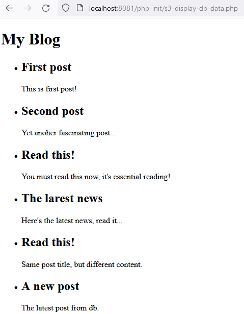
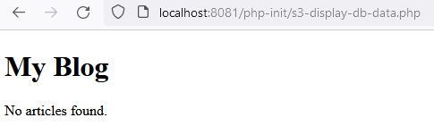
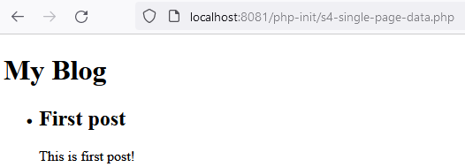
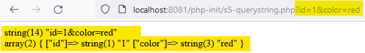
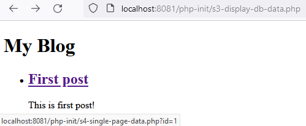

[display data, check if empty →][def]



```php
$sql = "SELECT *
  FROM article
//   WHERE id = 0 // data→nodata
  ORDER BY created_at;";
```



[def]: ../s3-display-db-data.php

[single page data →][def2]



[def2]: ../s4-single-page-data.php

[query string →][def3]





[def3]: ../s5-querystring.php
