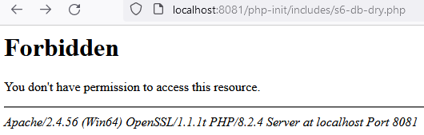
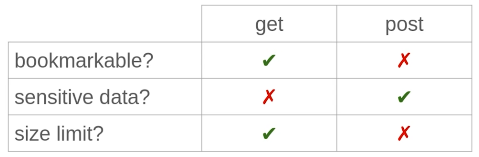
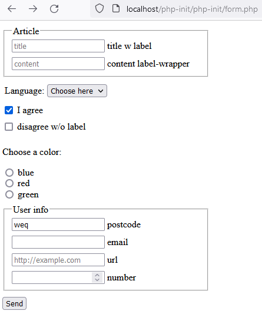
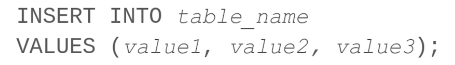
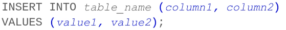
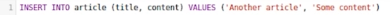
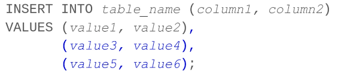
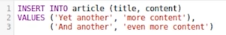
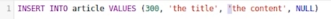
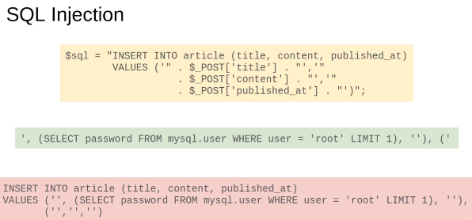

[display data, check if empty →][def]


```php
$sql = "SELECT *
  FROM article
//   WHERE id = 0 // data→nodata
  ORDER BY created_at;";
```


[def]: ../s3-display-db-data.php

[single page data →][def2]


[def2]: ../s4-single-page-data.php

[query string →][def3]


```php
// TO AVOID SQL INJECTION!!!
// validate id's passed in from Query String!!!
// check id's set (hide err msg abt id's) && number
if (isset($_GET['id']) && is_numeric($_GET['id'])) {
```

[avoid sql injection validate incoming data →][def5]

[def5]: ../s4-single-page-data.php


[def3]: ../s5-querystring.php

[extract repeated code →][def4]

[def4]: ../s6-db-dry.php

[deny access →][def6]



[def6]: ../includes/.htaccess

[get data from user (get/post) →][def7]



[def7]: ../form.php

[HTML5 form intro →][def8]



[def8]: ../form.php

[insert data →](../new-article.php)



- insert spec columns (val = num, order spec col)






- insert multiple






- e.g.



- e.g.


- res


- sql inj-on


